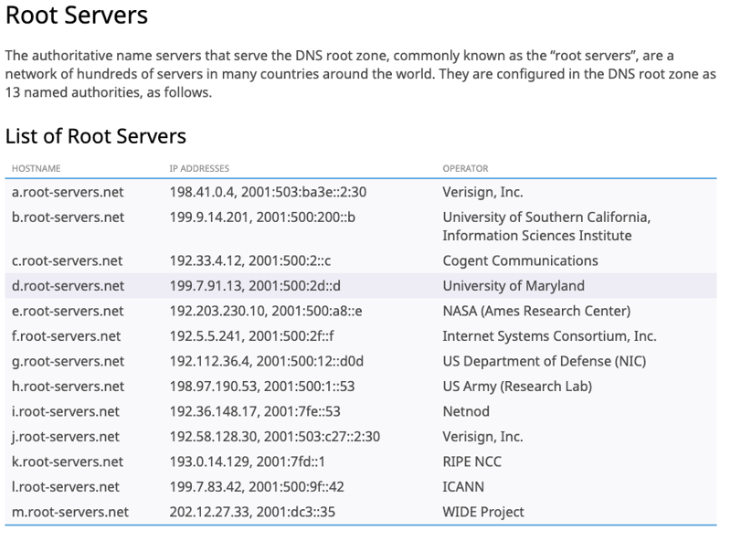
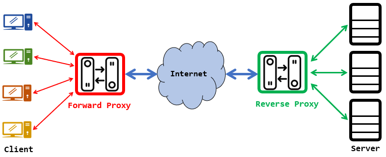

### 💬 About ME

- 안녕하세요. 데이터 엔지니어 한기호입니다.
- 내가 아는 것을 상대방에게 쉽게 알려주는 것을 좋아합니다.  
- 맡은 것을 끝까지 완료해서 함께 일하고 싶은 사람이 되려고 합니다.

### 🌱 Soomers Blog

<table>
        <tbody>
            <tr>
                    <td>
2023. 9. 26.
<a href="https://soomers.tistory.com/158"> 
[네트워크] DNS란?
</a>
        
목차 1. DNS란? 2. DNS 동작과정 1. DNS란? Domain Name 
</td>        <td>
2023. 9. 25.
<a href="https://soomers.tistory.com/157"> 
[네트워크] Network Proxy란?
</a>
        
목차 1. Proxy의 개념 2. Forward Proxy 3. Reverse P
</td>        <td>
2023. 9. 23.
<a href="https://soomers.tistory.com/156"> 
[토이 프로젝트] 블로그 포스팅 깃허브 자동 연동 프로젝트
</a>
        
🚀 시작계기 Github에 집중하면 블로그가 비어가고, 블로그에 힘을 주면 Git
</td></tr><tr>        <td>
2023. 9. 21.
<a href="https://soomers.tistory.com/155"> 
[네트워크] 네트워크의 데이터와 생성과정
</a>
        
목차 1. 네트워크의 데이터 2. 생성과정 3. 용어정리 1. 네트워크의 데이터 
</td>        <td>
2023. 9. 21.
<a href="https://soomers.tistory.com/154"> 
[네트워크] Web과 HTTP프로토콜
</a>
        
웹이란? - 팀 버너스 리가 만든 네트워크 생태계이다. - 특정 논문의 마지막 "
</td>        <td>
2023. 9. 21.
<a href="https://soomers.tistory.com/153"> 
[네트워크] IP와 식별자
</a>
        
IP란 - 인터넷 프로토콜, 호스트의 주소로 기능함 - IPv4주소는 networ
</td>
            </tr>
        </tbody>
    </table>