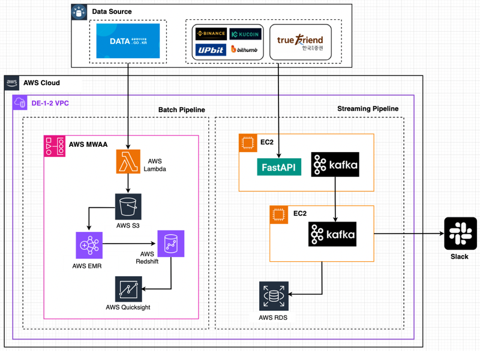

### 💬 About ME

- 안녕하세요. 데이터 엔지니어 한기호입니다.
- 주도적으로 일을 기획하고, 완성해 나가는 것을 좋아합니다.
- 함께 시너지를 내기 위해 알려주고 대화하는 것을 좋아합니다.

### 🌱 Soomers Blog

<table>
        <tbody>
            <tr>
                    <td>
2023. 10. 27.
<a href="https://soomers.tistory.com/164"> 
[MYSQL] SQL 날짜 등 정리
</a>
        
1. 1개월 이전, 이후의 date 값 - DATE_ADD(기준 date, INT
</td>        <td>
2023. 10. 26.
<a href="https://soomers.tistory.com/163"> 
[데이터 웨어하우스] STAR 스키마
</a>
        
📚 스타 스키마란? * 데이터 설계 및 저장 기법 중의 하나로, * 다차원 데이터
</td>        <td>
2023. 10. 23.
<a href="https://soomers.tistory.com/162"> 
데이터베이스 관련 정리
</a>
        
📚 데이터 베이스의 개념적 요소 개체(entity) : 데이터로 표현하려는 대상을
</td></tr><tr>        <td>
2023. 10. 5.
<a href="https://soomers.tistory.com/160"> 
[Projects] 팀 프로젝트 평가 및 프로젝트 개선 👀
</a>
        
🧐 들어가면서 공공데이터 포털에서 여러 데이터 소스를 ETL하여 DB에 적재하고 
</td>        <td>
2023. 10. 2.
<a href="https://soomers.tistory.com/159"> 
[Django] 기본 명령어 등 정리
</a>
        
프로젝트 생성 - django-admin startproject [프로젝트 명] 
</td>        <td>
2023. 9. 26.
<a href="https://soomers.tistory.com/158"> 
[네트워크] DNS란?
</a>
        
목차 1. DNS란? 2. DNS 동작과정 1. DNS란? Domain Name 
</td>
            </tr>
        </tbody>
    </table>